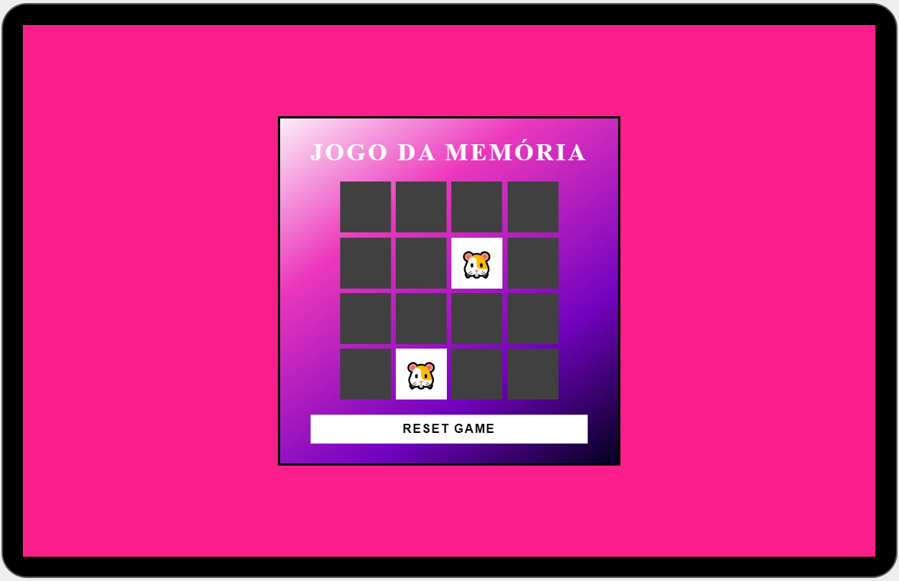
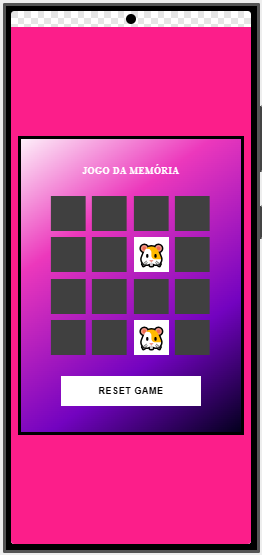

# Jogo da Memória

## Visão Geral

O **Jogo da Memória** é uma aplicação interativa projetada para estimular a memória e a concentração dos usuários por meio de um jogo clássico de pares. Com uma interface atraente e amigável, o jogo utiliza emojis como elementos visuais.

## Funcionalidades

- **Jogabilidade Simples**: Os usuários podem facilmente iniciar o jogo e clicar nas cartas para revelar os emojis. O objetivo é encontrar pares idênticos.
- **Design Responsivo**: A interface é otimizada para diferentes tamanhos de tela, proporcionando uma experiência de jogo fluida em dispositivos móveis e desktops.
- **Estética Atraente**: O uso de uma paleta de cores vibrantes e animações sutis contribui para uma experiência visual envolvente.
- **Reinício Fácil**: A opção de reiniciar o jogo permite que os usuários joguem várias vezes sem complicações.

## Tecnologias Utilizadas

- **HTML**: Estrutura básica da aplicação.
- **CSS**: Estilização e design responsivo.
- **JavaScript**: Lógica de jogo e interatividade.

## desktop screen 

## mobile screen

